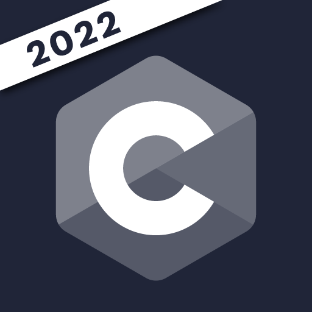
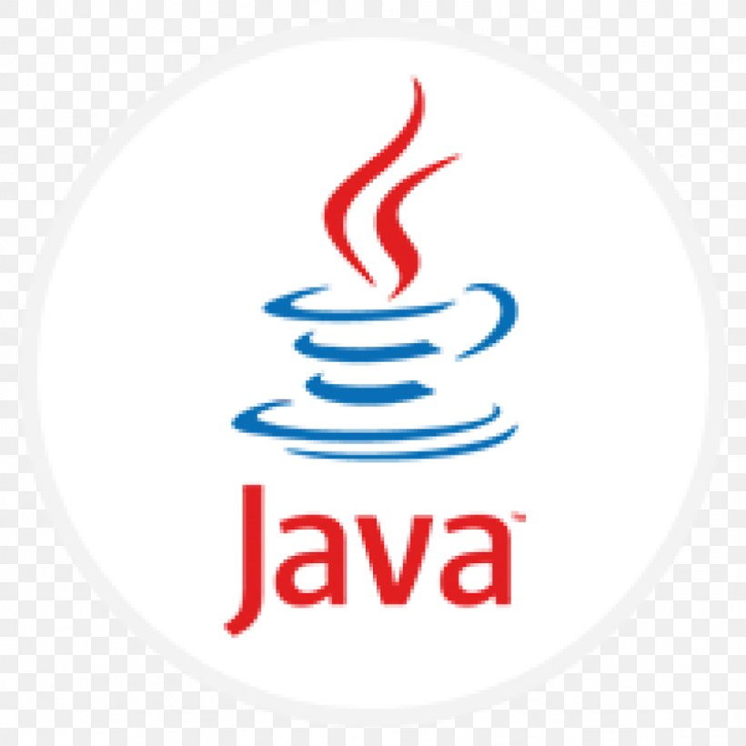

### Hey，欢迎来到 Aris 的小店

 
你好， 我是出生于1994年，一位有5年工作经验的后端开发工程师。 

- 💬 如果你对我感兴趣，可以加我[微信](./asset/wechat_id.png) 进一步交流。   
- 📫 我的邮箱: [aachenehurchan@gmail.com](mailto:aachenehurchan@gmail.com);  

**技术栈 与 开发工具:**

<code></code>  <code></code> <code></code> <code></code> <code></code> <code></code>

**我的开源项目:** 

   

**开发环境:**    
Macos + docker + docker-mac-net-connect + neovim 
